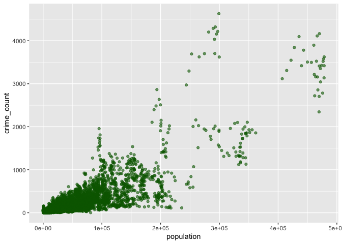

Cal Criminals Final Project Report
================
Pranava Sai Maganti,  
Umesh Sai Teja Poola,  
Meghasyam Peddireddy

# Introduction

The goal of this project is to analyze crime rates in California using
data from official records to identify trends and patterns in criminal
activity. Understanding crime rates is essential for enhancing public
safety, allocating law enforcement resources effectively, and
identifying key factors contributing to violent crimes. With crime
remaining a critical societal concern, this analysis aims to provide
insights into the factors influencing crime rates and geographic
disparities.

In pursuit of this goal, we conducted comprehensive data cleaning,
preprocessing, and exploratory analysis of crime datasets in California.
Our analysis focuses on answering the following questions:

1.  What are the overall trends in violent crime rates across the years
    in California?
2.  Are there regional disparities in crime rates across counties or
    cities?
3.  What types of violent crimes are most prevalent, and how do they
    compare across different areas?
4.  How does population size correlate with crime rates? Are more
    populated areas inherently at higher risk for crime?
5.  Are there differences in crime rates based on demographic factors
    such as race or ethnicity?

By exploring these key questions, our project aims to uncover meaningful
patterns and provide actionable insights that can support policymakers,
law enforcement, and community initiatives to reduce crime rates and
ensure public safety.

# Data

### **Structure**

The dataset used for this project is available at
[data.gov](https://catalog.data.gov/dataset/violent-crime-rate-9a68e).
The portal provides data on various aspects of crime, including violent
crime rates, demographic breakdowns, and geographic trends. The data
spans multiple years, with comprehensive details for each year’s
reported crimes.

For this analysis, we chose to focus on data from the years 2000
to 2013. This time frame provides a recent and consistent dataset,
ensuring that reporting methodologies remain stable and comparable
across the years. Additionally, analyzing 17 years of data allows us to
observe meaningful trends over time without overwhelming the analysis
with an unmanageable volume of information.

The dataset contains information from multiple aspects of crime
reporting, but to streamline our analysis, we focused on the variables
most relevant to violent crimes. These variables include:

- **Crime Type and Rate**: Details about the type of violent crimes
  (e.g., assault, homicide) and their rates per population.
- **Geographic Information**: Data on counties and regions where the
  crimes were reported.
- **Demographics**: Breakdowns of reported crime rates based on race and
  ethnicity, providing insights into population-specific trends.
- **Population Data**: Information about the population size for each
  geographic region to allow for normalization of crime rates.

The structure of the data is such that each row represents a reported
crime in a specific year and region, while other variables provide
detailed information about the crime. To keep the dataset manageable, we
focused on violent crime categories and excluded variables unrelated to
our analysis goals.

By carefully selecting the data and time frame, we created a cohesive
and focused dataset that enables us to effectively analyze trends and
patterns in violent crime rates across California.

## Data Cleaning and Preprocessing

### 1. Loading and Initial Data Inspection

First, we read in the dataset from the file `crimes-ca.xlsx` containing
crime data from California. The data is specifically loaded from the
“ViolentCrime” sheet.

``` r
# Load the required libraries
library(tidyverse)
```

    ## ── Attaching core tidyverse packages ──────────────────────── tidyverse 2.0.0 ──
    ## ✔ dplyr     1.1.4     ✔ readr     2.1.5
    ## ✔ forcats   1.0.0     ✔ stringr   1.5.1
    ## ✔ ggplot2   3.5.1     ✔ tibble    3.2.1
    ## ✔ lubridate 1.9.3     ✔ tidyr     1.3.1
    ## ✔ purrr     1.0.2     
    ## ── Conflicts ────────────────────────────────────────── tidyverse_conflicts() ──
    ## ✖ dplyr::filter() masks stats::filter()
    ## ✖ dplyr::lag()    masks stats::lag()
    ## ℹ Use the conflicted package (<http://conflicted.r-lib.org/>) to force all conflicts to become errors

``` r
library(readxl)
library(lubridate)
library(kableExtra)
```

    ## 
    ## Attaching package: 'kableExtra'
    ## 
    ## The following object is masked from 'package:dplyr':
    ## 
    ##     group_rows

``` r
# Read the data from Excel file
crimes_data <- read_excel("crimes-ca.xlsx", sheet = "ViolentCrime")
```

    ## Warning: Expecting numeric in A49228 / R49228C1: got 'END OF TABLE'

``` r
str(crimes_data)   # Display the structure of the dataset
```

    ## tibble [49,227 × 27] (S3: tbl_df/tbl/data.frame)
    ##  $ ind_id                : num [1:49227] 752 752 752 752 752 752 752 752 752 752 ...
    ##  $ ind_definition        : chr [1:49227] "Number of Violent Crimes per 1,000 Population" "Number of Violent Crimes per 1,000 Population" "Number of Violent Crimes per 1,000 Population" "Number of Violent Crimes per 1,000 Population" ...
    ##  $ reportyear            : chr [1:49227] "2000" "2000" "2000" "2000" ...
    ##  $ race_eth_code         : num [1:49227] 9 9 9 9 9 9 9 9 9 9 ...
    ##  $ race_eth_name         : chr [1:49227] "Total" "Total" "Total" "Total" ...
    ##  $ geotype               : chr [1:49227] "CA" "CA" "CA" "CA" ...
    ##  $ geotypevalue          : chr [1:49227] "06" "06" "06" "06" ...
    ##  $ geoname               : chr [1:49227] "California" "California" "California" "California" ...
    ##  $ county_fips           : chr [1:49227] NA NA NA NA ...
    ##  $ county_name           : chr [1:49227] NA NA NA NA ...
    ##  $ region_code           : chr [1:49227] NA NA NA NA ...
    ##  $ region_name           : chr [1:49227] NA NA NA NA ...
    ##  $ strata_name_code      : num [1:49227] 1 1 1 1 1 1 1 1 1 1 ...
    ##  $ strata_name           : chr [1:49227] "Type of violent crime" "Type of violent crime" "Type of violent crime" "Type of violent crime" ...
    ##  $ strata_level_name_code: num [1:49227] 1 2 3 4 5 1 2 3 4 5 ...
    ##  $ strata_level_name     : chr [1:49227] "Aggravated assault" "Forcible rape" "Murder and non-negligent manslaughter" "Robbery" ...
    ##  $ numerator             : num [1:49227] 138325 9784 2079 60237 210448 ...
    ##  $ denominator           : num [1:49227] 33847694 33847694 33847694 33847694 33847694 ...
    ##  $ rate                  : num [1:49227] NA NA NA NA 6.22 ...
    ##  $ ll_95ci               : num [1:49227] NA NA NA NA 6.19 ...
    ##  $ ul_95ci               : num [1:49227] NA NA NA NA 6.24 ...
    ##  $ se                    : num [1:49227] NA NA NA NA 0.0136 ...
    ##  $ rse                   : num [1:49227] NA NA NA NA 0.218 ...
    ##  $ ca_decile             : num [1:49227] NA NA NA NA NA NA NA NA NA NA ...
    ##  $ ca_rr                 : num [1:49227] NA NA NA NA 1 ...
    ##  $ dof_population        : num [1:49227] 33873086 33873086 33873086 33873086 33873086 ...
    ##  $ version               : POSIXct[1:49227], format: "2015-10-21 11:57:16" "2015-10-21 11:57:16" ...


### **Data Processing**

- Explain any steps taken to clean or preprocess the data:
  - Handling missing values
  - Transformations or filtering
  - Feature engineering, if applicable

------------------------------------------------------------------------

### 2. Data Quality Assessment

We checked for missing values and duplicate rows to identify
inconsistencies.

``` r
# Check for missing values in the dataset
missing_values <- colSums(is.na(crimes_data))
missing_values_df <- data.frame(
  Column = names(missing_values),
  Missing_Values = missing_values
)

# Display missing values in a table
missing_values_df %>%
  kable(caption = "Missing Values by Column") %>%
  kable_styling(bootstrap_options = c("striped", "hover"), full_width = FALSE)
```

<table class="table table-striped table-hover" style="color: black; width: auto !important; margin-left: auto; margin-right: auto;">
<caption>
Missing Values by Column
</caption>
<thead>
<tr>
<th style="text-align:left;">
</th>
<th style="text-align:left;">
Column
</th>
<th style="text-align:right;">
Missing_Values
</th>
</tr>
</thead>
<tbody>
<tr>
<td style="text-align:left;">
ind_id
</td>
<td style="text-align:left;">
ind_id
</td>
<td style="text-align:right;">
1
</td>
</tr>
<tr>
<td style="text-align:left;">
ind_definition
</td>
<td style="text-align:left;">
ind_definition
</td>
<td style="text-align:right;">
1
</td>
</tr>
<tr>
<td style="text-align:left;">
reportyear
</td>
<td style="text-align:left;">
reportyear
</td>
<td style="text-align:right;">
1
</td>
</tr>
<tr>
<td style="text-align:left;">
race_eth_code
</td>
<td style="text-align:left;">
race_eth_code
</td>
<td style="text-align:right;">
1
</td>
</tr>
<tr>
<td style="text-align:left;">
race_eth_name
</td>
<td style="text-align:left;">
race_eth_name
</td>
<td style="text-align:right;">
1
</td>
</tr>
<tr>
<td style="text-align:left;">
geotype
</td>
<td style="text-align:left;">
geotype
</td>
<td style="text-align:right;">
1
</td>
</tr>
<tr>
<td style="text-align:left;">
geotypevalue
</td>
<td style="text-align:left;">
geotypevalue
</td>
<td style="text-align:right;">
1
</td>
</tr>
<tr>
<td style="text-align:left;">
geoname
</td>
<td style="text-align:left;">
geoname
</td>
<td style="text-align:right;">
1
</td>
</tr>
<tr>
<td style="text-align:left;">
county_fips
</td>
<td style="text-align:left;">
county_fips
</td>
<td style="text-align:right;">
1051
</td>
</tr>
<tr>
<td style="text-align:left;">
county_name
</td>
<td style="text-align:left;">
county_name
</td>
<td style="text-align:right;">
1051
</td>
</tr>
<tr>
<td style="text-align:left;">
region_code
</td>
<td style="text-align:left;">
region_code
</td>
<td style="text-align:right;">
71
</td>
</tr>
<tr>
<td style="text-align:left;">
region_name
</td>
<td style="text-align:left;">
region_name
</td>
<td style="text-align:right;">
71
</td>
</tr>
<tr>
<td style="text-align:left;">
strata_name_code
</td>
<td style="text-align:left;">
strata_name_code
</td>
<td style="text-align:right;">
1
</td>
</tr>
<tr>
<td style="text-align:left;">
strata_name
</td>
<td style="text-align:left;">
strata_name
</td>
<td style="text-align:right;">
1
</td>
</tr>
<tr>
<td style="text-align:left;">
strata_level_name_code
</td>
<td style="text-align:left;">
strata_level_name_code
</td>
<td style="text-align:right;">
1
</td>
</tr>
<tr>
<td style="text-align:left;">
strata_level_name
</td>
<td style="text-align:left;">
strata_level_name
</td>
<td style="text-align:right;">
1
</td>
</tr>
<tr>
<td style="text-align:left;">
numerator
</td>
<td style="text-align:left;">
numerator
</td>
<td style="text-align:right;">
16934
</td>
</tr>
<tr>
<td style="text-align:left;">
denominator
</td>
<td style="text-align:left;">
denominator
</td>
<td style="text-align:right;">
12137
</td>
</tr>
<tr>
<td style="text-align:left;">
rate
</td>
<td style="text-align:left;">
rate
</td>
<td style="text-align:right;">
41904
</td>
</tr>
<tr>
<td style="text-align:left;">
ll_95ci
</td>
<td style="text-align:left;">
ll_95ci
</td>
<td style="text-align:right;">
41904
</td>
</tr>
<tr>
<td style="text-align:left;">
ul_95ci
</td>
<td style="text-align:left;">
ul_95ci
</td>
<td style="text-align:right;">
41904
</td>
</tr>
<tr>
<td style="text-align:left;">
se
</td>
<td style="text-align:left;">
se
</td>
<td style="text-align:right;">
41904
</td>
</tr>
<tr>
<td style="text-align:left;">
rse
</td>
<td style="text-align:left;">
rse
</td>
<td style="text-align:right;">
41904
</td>
</tr>
<tr>
<td style="text-align:left;">
ca_decile
</td>
<td style="text-align:left;">
ca_decile
</td>
<td style="text-align:right;">
42926
</td>
</tr>
<tr>
<td style="text-align:left;">
ca_rr
</td>
<td style="text-align:left;">
ca_rr
</td>
<td style="text-align:right;">
41904
</td>
</tr>
<tr>
<td style="text-align:left;">
dof_population
</td>
<td style="text-align:left;">
dof_population
</td>
<td style="text-align:right;">
10567
</td>
</tr>
<tr>
<td style="text-align:left;">
version
</td>
<td style="text-align:left;">
version
</td>
<td style="text-align:right;">
1
</td>
</tr>
</tbody>
</table>

``` r
# Check for duplicate rows in the dataset
duplicate_count <- sum(duplicated(crimes_data))
cat("Number of duplicate rows:", duplicate_count, "\n")
```

    ## Number of duplicate rows: 0

------------------------------------------------------------------------

### 3. Data Cleaning

We performed the following cleaning steps to prepare the data for
analysis:

1.  **Removing Missing Values and Duplicate Rows**  
    Rows with missing values and duplicates were removed.

2.  **Renaming Columns for Consistency**  
    Column names were standardized to improve readability.

3.  **Calculating Crime Rates**  
    We calculated the crime rate per 100,000 population for each row.

4.  **Selecting Relevant Columns**  
    Only the required columns were retained for analysis.

``` r
# Clean the data step by step
cleaned_crimes <- crimes_data %>%
  drop_na() %>%                 # Remove rows with missing values
  distinct() %>%                # Remove duplicate rows
  mutate(
    crime_rate = (numerator / denominator) * 100000,  # Calculate crime rate
    reportyear = as.integer(reportyear)              # Convert year column to integer
  ) %>%
  rename(
    year = reportyear,          # Standardize column names
    crime_count = numerator,
    population = denominator,
    crime_type = strata_level_name
  ) %>%
  select(
    year,                       # Select and organize relevant columns
    region_name,
    county_name,
    crime_type,
    crime_count,
    population,
    crime_rate
  )

# Display the structure of the cleaned dataset
summary(cleaned_crimes) %>%
  kable(caption = "Summary of Cleaned Crime Dataset") %>%
  kable_styling(bootstrap_options = c("striped", "hover"), full_width = FALSE)
```

<table class="table table-striped table-hover" style="color: black; width: auto !important; margin-left: auto; margin-right: auto;">
<caption>
Summary of Cleaned Crime Dataset
</caption>
<thead>
<tr>
<th style="text-align:left;">
</th>
<th style="text-align:left;">
year
</th>
<th style="text-align:left;">
region_name
</th>
<th style="text-align:left;">
county_name
</th>
<th style="text-align:left;">
crime_type
</th>
<th style="text-align:left;">
crime_count
</th>
<th style="text-align:left;">
population
</th>
<th style="text-align:left;">
crime_rate
</th>
</tr>
</thead>
<tbody>
<tr>
<td style="text-align:left;">
</td>
<td style="text-align:left;">
Min. :2000
</td>
<td style="text-align:left;">
Length:6251
</td>
<td style="text-align:left;">
Length:6251
</td>
<td style="text-align:left;">
Length:6251
</td>
<td style="text-align:left;">
Min. : 1.0
</td>
<td style="text-align:left;">
Min. : 90
</td>
<td style="text-align:left;">
Min. : 2.47
</td>
</tr>
<tr>
<td style="text-align:left;">
</td>
<td style="text-align:left;">
1st Qu.:2003
</td>
<td style="text-align:left;">
Class :character
</td>
<td style="text-align:left;">
Class :character
</td>
<td style="text-align:left;">
Class :character
</td>
<td style="text-align:left;">
1st Qu.: 33.0
</td>
<td style="text-align:left;">
1st Qu.: 12070
</td>
<td style="text-align:left;">
1st Qu.: 188.00
</td>
</tr>
<tr>
<td style="text-align:left;">
</td>
<td style="text-align:left;">
Median :2007
</td>
<td style="text-align:left;">
Mode :character
</td>
<td style="text-align:left;">
Mode :character
</td>
<td style="text-align:left;">
Mode :character
</td>
<td style="text-align:left;">
Median : 93.0
</td>
<td style="text-align:left;">
Median : 30785
</td>
<td style="text-align:left;">
Median : 338.90
</td>
</tr>
<tr>
<td style="text-align:left;">
</td>
<td style="text-align:left;">
Mean :2007
</td>
<td style="text-align:left;">
NA
</td>
<td style="text-align:left;">
NA
</td>
<td style="text-align:left;">
NA
</td>
<td style="text-align:left;">
Mean : 348.4
</td>
<td style="text-align:left;">
Mean : 66287
</td>
<td style="text-align:left;">
Mean : 565.25
</td>
</tr>
<tr>
<td style="text-align:left;">
</td>
<td style="text-align:left;">
3rd Qu.:2010
</td>
<td style="text-align:left;">
NA
</td>
<td style="text-align:left;">
NA
</td>
<td style="text-align:left;">
NA
</td>
<td style="text-align:left;">
3rd Qu.: 247.0
</td>
<td style="text-align:left;">
3rd Qu.: 66788
</td>
<td style="text-align:left;">
3rd Qu.: 549.32
</td>
</tr>
<tr>
<td style="text-align:left;">
</td>
<td style="text-align:left;">
Max. :2013
</td>
<td style="text-align:left;">
NA
</td>
<td style="text-align:left;">
NA
</td>
<td style="text-align:left;">
NA
</td>
<td style="text-align:left;">
Max. :52243.0
</td>
<td style="text-align:left;">
Max. :3879455
</td>
<td style="text-align:left;">
Max. :79569.89
</td>
</tr>
</tbody>
</table>

### Variables

Below is a list of variables used in the dataset along with their
descriptions:

- year: The year in which the crime occurred.
- region_name: The region where the crime was recorded.
- county_name: The name of the county where the crime occurred.
- crime_type: The type or category of crime reported.
- crime_count: The total number of crimes reported for a given record.
- population: The population count corresponding to the crime location.
- crime_rate: The crime rate calculated per 100,000 population.

------------------------------------------------------------------------

### 4. Saving Cleaned Data

The cleaned dataset was saved as a CSV file for further analysis.

``` r
# Save the cleaned dataset for future use
write.csv(cleaned_crimes, "cleaned_crimes_data.csv", row.names = FALSE)
cat("Cleaned dataset saved as 'cleaned_crimes_data.csv'.\n")
```

    ## Cleaned dataset saved as 'cleaned_crimes_data.csv'.

------------------------------------------------------------------------

### Summary of Cleaning Steps:

1.  Removed missing values and duplicate rows.
2.  Renamed columns for clarity (`reportyear` → `year`, `numerator` →
    `crime_count`).
3.  Calculated crime rates per 100,000 population.
4.  Selected relevant columns: `year`, `region_name`, `county_name`,
    `crime_type`, `crime_count`, `population`, and `crime_rate`.
5.  Saved the cleaned dataset for further analysis.

------------------------------------------------------------------------

# Results

### Key Findings

Present your results with appropriate visuals and summaries: - Use
tables or plots to communicate findings.

#### Example Plot

``` r
# Example Code for a Plot (Replace with your actual code)
library(ggplot2)

data(mpg) # Sample dataset
ggplot(mpg, aes(x=class, fill=drv)) +
    geom_bar() +
    labs(title="Example Plot: Count of Vehicles by Class",
         x="Vehicle Class", y="Count")
```

<!-- -->
